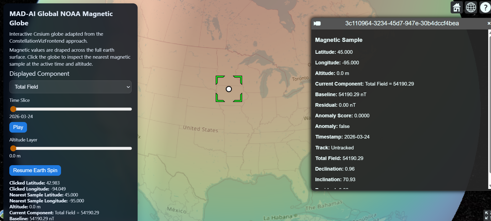
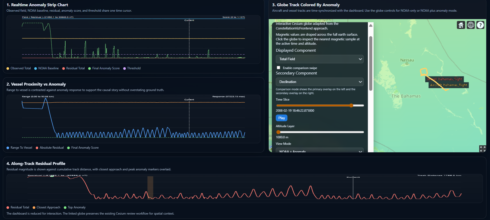

# MAD-AI

`MAD-AI` is a Python project for magnetic anomaly detection using:

- a geomagnetic baseline model based on NOAA World Magnetic Model data
- residual feature engineering between observed and baseline magnetic values
- spatial and temporal anomaly models
- 2D/3D visualization, including an interactive Cesium globe

The repo currently includes a working end-to-end prototype with:

- NOAA/WMM-backed baseline generation
- processed dataset builders
- trainable reference anomaly models
- evaluation and threshold calibration
- a globe visualizer with:
  - OpenStreetMap earth layer
  - day/night lighting
  - earth rotation
  - full-earth magnetic overlay
  - altitude slider
  - click-on-surface magnetic inspection
  - overlay legend showing the active value range
  - comparison swipe mode
  - anomaly filtering and hotspot jumps
  - observed anomaly globe generation from CSV inputs
  - real-batch globe generation from folder-based inputs
  - mixed-format ingestion for CSV, Parquet, JSONL, and SQLite sensor batches
  - a larger real-batch scaling config for calibration and tuning workflows
  - a Bahamas real-data workflow with aircraft and vessel state ingestion from `.asc` flight data
  - a combined NOAA-only / NOAA-plus-anomaly Cesium viewer for the Bahamas example
  - a linked four-view Bahamas realtime dashboard with strip chart, vessel range comparison, synchronized globe, and along-track residual profile
  - a first-pass magnetic vessel tracking path with estimated-versus-true vessel comparison views

## Current Capability Vs Gap

What the repo can do today:

- use NOAA/WMM-style magnetic baseline modeling as the reference field
- take real Bahamas aircraft magnetometer readings at specific aircraft locations
- score whether those readings look anomalous relative to the baseline
- initialize a first-pass vessel track estimate from magnetic residuals and aircraft geometry
- run a first-pass vessel tracker and compare the estimated vessel path against the true/reference vessel path
- visualize the aircraft track, true vessel track, and estimated magnetic vessel track in the linked dashboard and 3D globe

What is not yet done to an operational standard:

- the full-file Bahamas path is still mainly exercised with the `analytic` backend rather than full practical `WMM`
- anomaly calibration still needs stronger real labeled evidence
- the first-pass magnetic tracker is still weak on the full Bahamas run, with mean tracking error still around `13 km`
- the current system is best described as a working prototype and evaluation workflow, not a validated operational tracker

Short version:

- concept requirement: largely done
- validated operational-quality requirement: not yet

## Repo Layout

```text
MAD-AI/
|-- config/                 # YAML config files
|-- data/                   # raw, cache, and processed data artifacts
|-- docs/                   # architecture and milestone docs
|-- outputs/                # generated models, figures, calibration, evaluation, viewer assets
|-- scripts/                # runnable project entry points
|-- src/mad_ai/             # Python package
`-- tests/unit/             # unit tests
```

Important docs:

- [docs/architecture.md](c:/Users/MrSit/source/repos/MAD-AI/docs/architecture.md)
- [docs/mad-ai-milestone.md](c:/Users/MrSit/source/repos/MAD-AI/docs/mad-ai-milestone.md)

## Requirements

- Python `3.10+`
- Windows PowerShell commands below assume Windows, but the Python code is portable
- internet access is useful for the Cesium/OpenStreetMap viewer layer

## Installation

Create a virtual environment and install the project:

```powershell
python -m venv .venv
.venv\Scripts\Activate.ps1
pip install -e .
```

If you want the optional dependencies used by ML, WMM backends, and development tools:

```powershell
pip install -e .[ml,wmm,dev]
```

If you want the optional desktop UI dependency:

```powershell
pip install -e .[viz]
```

## Quick Start

Build the sample artifacts and run the baseline inference path:

```powershell
python scripts\build_processed_datasets.py
python scripts\run_inference.py
```

Generate the global NOAA dataset and visualization artifacts:

```powershell
python scripts\build_global_noaa_grid.py
python scripts\generate_global_noaa_visualizations.py
```

## Magnetic Backends

The repo supports two magnetic baseline modes:

- `WMM`
  The operational reference path. This uses the NOAA/WMM-derived backend in [model.py](c:/Users/MrSit/source/repos/MAD-AI/src/mad_ai/wmm/model.py) and should be used for physically meaningful magnetic baseline generation.
- `analytic`
  A fast deterministic fallback from [model.py](c:/Users/MrSit/source/repos/MAD-AI/src/mad_ai/wmm/model.py). This is useful for pipeline scaling, tests, and larger bundled example runs where runtime matters more than physical fidelity.

In practice:

- use `WMM` for NOAA-backed baseline analysis and production-style workflows
- use `analytic` for the bundled large scaling config and fast local validation

Current practical note:

- the linked Bahamas realtime review flow exists today, but the full-flight operational path has mainly been exercised with the `analytic` backend because full-file `WMM` runtime still needs optimization
- use [benchmark_magnetic_backends.py](c:/Users/MrSit/source/repos/MAD-AI/scripts/benchmark_magnetic_backends.py) to save a reproducible local benchmark report before changing backend guidance

## Visualizer

`MAD-AI` has two main review experiences:

1. a 3D Cesium globe for spatial review
2. a linked Bahamas dashboard for time-based anomaly review

### 3D Globe Visualizer

The main globe visualizer is:

- [outputs/viewer/cesium_global_magnetic_globe.html](c:/Users/MrSit/source/repos/MAD-AI/outputs/viewer/cesium_global_magnetic_globe.html)

Preview:



What the 3D globe is for:

- reviewing the NOAA/WMM magnetic baseline on the earth surface
- switching between magnetic components such as total field, declination, inclination, and residual
- inspecting anomaly overlays when scored data is available
- checking where tracks and anomaly hotspots sit geographically

What you see in the globe:

- the earth rendered with OpenStreetMap imagery
- a draped magnetic overlay across the world surface
- a left-side control panel for component, altitude, time, comparison mode, filtering, and export
- track overlays when the loaded dataset contains aircraft or anomaly paths
- click-based inspection of the nearest sample under the cursor

How to run the 3D globe:

```powershell
python scripts\serve_cesium_viewer.py
```

Then open:

```text
http://127.0.0.1:8765/cesium_global_magnetic_globe.html
```

If you need to regenerate the global NOAA viewer assets first:

```powershell
python scripts\build_global_noaa_grid.py
python scripts\generate_global_noaa_visualizations.py
```

How to use the 3D globe:

1. Use `Displayed Component` to choose what the surface overlay means.
   `Total Field` shows the baseline magnetic field, while `Residual` or anomaly-score layers show deviation from the baseline.
2. Use `Altitude Layer` to move between the available magnetic surfaces.
3. Use `Time Slice` when the loaded data has temporal samples.
4. Click on the globe to inspect the nearest magnetic sample and read the values in the side panel.
5. Use `Compare` mode if you want to swipe between two magnetic layers.
6. Use `Score Threshold Filter` and `Anomaly-only` when reviewing scored anomaly outputs.
7. Use `Jump To Hotspot` to move between the strongest currently visible anomaly points.

What the main globe controls mean:

- `Displayed Component`
  selects the surface or anomaly quantity being colored on the globe
- `Secondary Component`
  selects the comparison overlay for swipe mode
- `Time Slice`
  moves through timestamped samples when the dataset has time structure
- `Altitude Layer`
  switches between the available baseline or review surfaces
- `View Mode`
  switches between baseline-only and baseline-plus-anomaly overlays when supported
- `Score Threshold Filter`
  hides lower-score points so you can focus on stronger events

### Bahamas Realtime Dashboard

The Bahamas review dashboard is:

- [outputs/viewer/bahamas_realtime_dashboard.html](c:/Users/MrSit/source/repos/MAD-AI/outputs/viewer/bahamas_realtime_dashboard.html)

Preview:



What the dashboard provides:

- a single shared time cursor across four linked views
- direct comparison between observed magnetometer readings and the NOAA-style baseline
- range-to-vessel context next to anomaly response
- a synchronized embedded 3D globe for geographic context
- an along-track residual view that makes localized anomaly bumps easier to see

The four dashboard views are:

1. `Realtime Anomaly Strip Chart`
   shows `Observed Total`, `NOAA Baseline Total`, `Residual Total`, `Final Anomaly Score`, and the anomaly threshold over time
2. `Vessel Proximity vs Anomaly`
   shows `range_to_vessel_m` against anomaly response so you can see whether anomaly strength increases as geometry changes
3. `3D Globe Track Colored By Anomaly`
   embeds the Cesium globe and keeps it synchronized to the current dashboard time
4. `Along-Track Residual Profile`
   shows residual behavior against cumulative distance with closest-approach and high-anomaly markers

How to run the Bahamas dashboard:

```powershell
python scripts\score_bahamas_realtime_anomalies.py inspection\external_mad_repo\data\raw\mad_data.asc data\processed\bahamas\bahamas_mad_scored.csv outputs\evaluation\bahamas_mad_summary.json analytic stable_window
python scripts\build_bahamas_noaa_combined_viewer.py outputs\viewer\cesium_bahamas_noaa_combined.html data\processed\global_noaa\global_wmm_grid.csv data\processed\bahamas\bahamas_mad_scored.csv
python scripts\build_bahamas_realtime_dashboard.py data\processed\bahamas\bahamas_mad_scored.csv outputs\evaluation\bahamas_mad_summary.json outputs\viewer\bahamas_realtime_dashboard.html cesium_bahamas_noaa_combined.html
python scripts\serve_cesium_viewer.py
```

Then open:

```text
http://127.0.0.1:8765/bahamas_realtime_dashboard.html
```

How to use the Bahamas dashboard:

1. Move the dashboard `time` slider to select the current sample.
2. Watch the strip chart to compare observed field, baseline field, residual, and anomaly score at that moment.
3. Watch the vessel-range chart to see whether anomaly strength changes with aircraft-to-vessel separation.
4. Use the embedded globe to inspect the same moment spatially.
5. Use the along-track profile to see where the anomaly bump occurs along the aircraft path.
6. Use `Play`, `Closest Approach`, and `Top Anomaly` to move quickly through the most important parts of the run.

Important interpretation note:

- the anomaly signal comes from aircraft-borne magnetometer residuals against the magnetic baseline
- the dashboard shows both:
  - the true/reference vessel path from the dataset
  - the estimated magnetic vessel track produced by the first-pass tracker
- the current tracker is still experimental and should be treated as an inverse-tracking prototype, not an operational vessel-tracking solution

### Observed Anomaly Globe

To score a real observed CSV and build an anomaly-aware globe:

```powershell
python scripts\score_observed_csv_anomalies.py data\raw\sample_sensor.csv
python scripts\build_observed_anomaly_cesium_viewer.py data\raw\sample_sensor.csv
```

Outputs:

- [data/processed/observed_scored/observed_anomaly_scored.csv](c:/Users/MrSit/source/repos/MAD-AI/data/processed/observed_scored/observed_anomaly_scored.csv)
- [outputs/evaluation/observed_anomaly_summary.json](c:/Users/MrSit/source/repos/MAD-AI/outputs/evaluation/observed_anomaly_summary.json)
- [outputs/viewer/cesium_observed_anomaly_globe.html](c:/Users/MrSit/source/repos/MAD-AI/outputs/viewer/cesium_observed_anomaly_globe.html)

The observed anomaly globe supports:

- observed total field
- baseline total field
- residual total field
- spatial anomaly score
- temporal anomaly score
- final anomaly score
- comparison swipe between baseline-style and fused views when applicable

### Real Batch Workflow

For folder-based real data ingestion with schema mapping and split-aware evaluation:

```powershell
python scripts\evaluate_real_batch_models.py
python scripts\build_real_batch_cesium_viewer.py
```

Config:

- [config/real_batch.yaml](c:/Users/MrSit/source/repos/MAD-AI/config/real_batch.yaml)

Sample batch input:

- [data/raw/real_batch](c:/Users/MrSit/source/repos/MAD-AI/data/raw/real_batch)

Generated artifacts:

- [outputs/models/real_batch_spatial.pt](c:/Users/MrSit/source/repos/MAD-AI/outputs/models/real_batch_spatial.pt)
- [outputs/models/real_batch_temporal.pt](c:/Users/MrSit/source/repos/MAD-AI/outputs/models/real_batch_temporal.pt)
- [outputs/calibration/real_batch_thresholds.json](c:/Users/MrSit/source/repos/MAD-AI/outputs/calibration/real_batch_thresholds.json)
- [outputs/evaluation/real_batch_metrics.json](c:/Users/MrSit/source/repos/MAD-AI/outputs/evaluation/real_batch_metrics.json)
- [outputs/evaluation/real_batch_false_positive_analysis.json](c:/Users/MrSit/source/repos/MAD-AI/outputs/evaluation/real_batch_false_positive_analysis.json)
- [outputs/evaluation/real_batch_baseline_fused_comparison.json](c:/Users/MrSit/source/repos/MAD-AI/outputs/evaluation/real_batch_baseline_fused_comparison.json)
- [data/processed/real_batch_scored/real_batch_scored.csv](c:/Users/MrSit/source/repos/MAD-AI/data/processed/real_batch_scored/real_batch_scored.csv)
- [outputs/viewer/cesium_real_batch_globe.html](c:/Users/MrSit/source/repos/MAD-AI/outputs/viewer/cesium_real_batch_globe.html)

This workflow supports:

- multi-file folder ingestion
- mixed source formats across a batch, including CSV, Parquet, JSONL, and SQLite
- schema mapping into the project's canonical sensor columns
- per-dataset manifest metadata for provenance, split definitions, units, coordinate convention, and known data-quality issues
- nominal-train, calibration, nominal-eval, and anomalous-eval splits
- real-data recalibration from nominal data
- evaluation on abnormal segments
- calibration robustness reporting across multiple percentiles
- explicit nominal false-positive analysis with percentile sweeps plus per-track and per-source breakdowns
- explicit baseline-only versus fused evaluation summaries for nominal and anomalous splits
- baseline-only residual anomaly scoring alongside fused anomaly scoring
- viewer generation from the scored real batch output
- comparison swipe mode between baseline-only and fused anomaly overlays in the globe

### Bahamas Real-Data Workflow

For the real Bahamas aircraft plus vessel dataset:

```powershell
python scripts\score_bahamas_realtime_anomalies.py inspection\external_mad_repo\data\raw\mad_data.asc data\processed\bahamas\bahamas_mad_scored.csv outputs\evaluation\bahamas_mad_summary.json analytic stable_window
python scripts\evaluate_bahamas_tracking.py data\processed\bahamas\bahamas_mad_scored.csv outputs\evaluation\bahamas_tracking_metrics_multi.json outputs\evaluation\bahamas_tracking_estimates_multi.csv multi
python scripts\build_bahamas_noaa_combined_viewer.py outputs\viewer\cesium_bahamas_noaa_combined.html data\processed\global_noaa\global_wmm_grid.csv data\processed\bahamas\bahamas_mad_scored.csv outputs\evaluation\bahamas_tracking_estimates_multi.csv
python scripts\build_bahamas_realtime_dashboard.py data\processed\bahamas\bahamas_mad_scored.csv outputs\evaluation\bahamas_mad_summary.json outputs\viewer\bahamas_realtime_dashboard.html cesium_bahamas_noaa_combined.html outputs\evaluation\bahamas_tracking_estimates_multi.csv
python scripts\serve_cesium_viewer.py
```

Main outputs:

- [outputs/viewer/cesium_bahamas_noaa_combined.html](c:/Users/MrSit/source/repos/MAD-AI/outputs/viewer/cesium_bahamas_noaa_combined.html)
- [outputs/viewer/bahamas_realtime_dashboard.html](c:/Users/MrSit/source/repos/MAD-AI/outputs/viewer/bahamas_realtime_dashboard.html)
- [outputs/evaluation/bahamas_mad_summary.json](c:/Users/MrSit/source/repos/MAD-AI/outputs/evaluation/bahamas_mad_summary.json)
- [outputs/evaluation/bahamas_tracking_metrics_multi.json](c:/Users/MrSit/source/repos/MAD-AI/outputs/evaluation/bahamas_tracking_metrics_multi.json)

What this workflow does today:

- loads aircraft-borne magnetometer readings from the Bahamas `.asc` dataset
- computes magnetic baseline, residual, and anomaly scores along the aircraft track
- runs a first-pass vessel tracker from magnetic residuals and aircraft geometry
- shows both the provided vessel-reference track and the estimated magnetic vessel track
- links strip-chart, range-to-vessel, globe, and along-track views through a shared time cursor

Important current limitation:

- the anomaly signal comes from magnetometer residuals against the baseline
- the reference vessel path is still used as truth for evaluation and visual comparison
- the estimated vessel track is first-pass only and is not yet accurate enough for operational claims
- the tracking evaluation now reports segment-level error summaries and weak/moderate/strong confidence buckets, but those confidence labels are still heuristic rather than calibrated

To compare bounded Bahamas tracking quality between `analytic` and `WMM` backends on a subset:

```powershell
python scripts\compare_bahamas_tracking_backends.py inspection\external_mad_repo\data\raw\mad_data.asc outputs\evaluation\bahamas_tracking_backend_comparison_subset.json 2000
```

That means the current Bahamas path is:

- anomaly detection with first-pass inverse vessel tracking and known vessel truth for evaluation

- but not yet:

- validated operational-quality inverse vessel tracking from magnetometer measurements

### Larger Real Batch Scaling Workflow

For a larger mixed-format example dataset plus tuning and stronger nominal calibration:

```powershell
python scripts\generate_large_real_batch_dataset.py
python scripts\evaluate_real_batch_models.py config\real_batch_large.yaml
python scripts\tune_real_batch_models.py config\real_batch_large.yaml
python scripts\build_real_batch_cesium_viewer.py config\real_batch_large.yaml outputs\viewer\cesium_real_batch_large_globe.html
```

Config:

- [config/real_batch_large.yaml](c:/Users/MrSit/source/repos/MAD-AI/config/real_batch_large.yaml)

Generated artifacts:

- [outputs/evaluation/real_batch_tuning_leaderboard.csv](c:/Users/MrSit/source/repos/MAD-AI/outputs/evaluation/real_batch_tuning_leaderboard.csv)
- [outputs/evaluation/real_batch_tuning_summary.json](c:/Users/MrSit/source/repos/MAD-AI/outputs/evaluation/real_batch_tuning_summary.json)
- [outputs/evaluation/real_batch_calibration_robustness.json](c:/Users/MrSit/source/repos/MAD-AI/outputs/evaluation/real_batch_calibration_robustness.json)
- [outputs/viewer/cesium_real_batch_large_globe.html](c:/Users/MrSit/source/repos/MAD-AI/outputs/viewer/cesium_real_batch_large_globe.html)

Notes:

- the bundled large scaling config uses the analytic magnetic backend for runtime practicality
- this does not replace the NOAA/WMM-backed workflow; it only makes the larger sample scaling run finish quickly
- the operational NOAA/WMM-backed path remains available through the default WMM workflows and is the reference baseline path
- the generated large dataset is still synthetic and intended for pipeline scaling checks, not production claims
- the bundled dataset manifests now record source formats, timestamp encoding, schema mapping, split paths, and documented data-quality limits
- non-default real-batch configs now save dataset-specific evaluation artifact names such as `real_batch_large_synthetic_metrics.json` so runs do not overwrite the default sample outputs

### Backend Benchmarking

To measure the current local runtime tradeoff between `analytic` and `WMM` on bundled representative workflows:

```powershell
python scripts\benchmark_magnetic_backends.py
```

Output:

- [outputs/benchmarks/magnetic_backend_benchmark.json](c:/Users/MrSit/source/repos/MAD-AI/outputs/benchmarks/magnetic_backend_benchmark.json)

Interpretation:

- use `WMM` for global baseline products, reviewer-facing evidence, and any reported magnetic baseline result
- use `analytic` for tests, local iteration, tuning loops, and scaling checks where speed matters more than physical fidelity
- the current local benchmark also showed that batching WMM queries inside residual-feature preparation materially reduced the bundled preparation overhead

### Current Global Viewer Data

The current global magnetic surface is built from:

- [data/processed/global_noaa/global_wmm_grid.csv](c:/Users/MrSit/source/repos/MAD-AI/data/processed/global_noaa/global_wmm_grid.csv)
- [data/processed/global_noaa/global_wmm_grid_metadata.json](c:/Users/MrSit/source/repos/MAD-AI/data/processed/global_noaa/global_wmm_grid_metadata.json)

Current settings:

- global grid resolution: `2 deg x 2 deg`
- altitude layers: `0`, `1000`, `5000`, `10000 m`
- timestamp: `2026-03-24T00:00:00`

## Key Scripts

### Data And Baseline

- `python scripts\build_processed_datasets.py`
  - builds processed artifacts from sample data
- `python scripts\build_processed_datasets_from_csv.py <input_csv> [output_dir]`
  - builds processed artifacts from a real CSV file
- `python scripts\build_global_noaa_grid.py`
  - builds the multi-altitude global NOAA/WMM dataset
- `python scripts\import_noaa_wmm_coefficients.py`
  - imports the official NOAA WMM coefficient bundle into `data/raw/`

### Models And Inference

- `python scripts\train_spatial.py`
  - trains the spatial reference model
- `python scripts\train_temporal.py`
  - trains the temporal reference model
- `python scripts\calibrate_thresholds.py`
  - calibrates anomaly thresholds from nominal data
- `python scripts\evaluate_models.py`
  - computes evaluation metrics and saves evaluation artifacts
- `python scripts\run_inference.py`
  - runs the anomaly inference path

### Visualization

- `python scripts\generate_visualizations.py`
  - general 2D/3D visual outputs
- `python scripts\generate_noaa_wmm_visualizations.py`
  - NOAA-labelled visual outputs
- `python scripts\generate_global_noaa_visualizations.py`
  - global 2D/3D/interactive NOAA outputs
- `python scripts\serve_cesium_viewer.py`
  - local HTTP server for the viewer assets
- `python scripts\launch_visualizer.py`
  - generates the broader visualizer artifact pack
- `python scripts\build_bahamas_noaa_combined_viewer.py [output_html] [global_grid_csv] [scored_csv]`
  - generates the combined Bahamas NOAA-only / NOAA-plus-anomaly globe, optionally with tracking estimates
- `python scripts\evaluate_bahamas_tracking.py [scored_csv] [output_json] [estimated_csv] [tracker_mode]`
  - evaluates the first-pass magnetic vessel tracker against the reference vessel path
- `python scripts\build_bahamas_realtime_dashboard.py [scored_csv] [summary_json] [output_html] [globe_html] [tracking_estimates_csv]`
  - generates the linked Bahamas review dashboard with estimated-versus-true vessel comparison

### Specialized Globe Variants

- `python scripts\build_cesium_globe_viewer.py`
- `python scripts\build_time_series_cesium_globe.py`
- `python scripts\build_multi_altitude_cesium_globe.py`
- `python scripts\build_tracked_cesium_globe.py`
- `python scripts\build_observed_csv_cesium_viewer.py <input_csv>`
- `python scripts\build_observed_anomaly_cesium_viewer.py <input_csv>`
- `python scripts\evaluate_real_batch_models.py [config_path]`
- `python scripts\score_real_batch_folder.py <input_dir> [config_path] [output_csv] [summary_json]`
- `python scripts\build_real_batch_cesium_viewer.py [config_path] [output_html]`
- `python scripts\generate_large_real_batch_dataset.py [output_root]`
- `python scripts\tune_real_batch_models.py [config_path]`

## Testing

Current verification snapshot:

- all project phases are functionally complete
- `47` unit tests are passing
- CI runs the unit suite on pushes and pull requests

Run the unit test suite:

```powershell
python -m unittest discover -s tests\unit -p "test_*.py" -v
```

CI:

- [.github/workflows/ci.yml](c:/Users/MrSit/source/repos/MAD-AI/.github/workflows/ci.yml) runs the unit suite on pushes and pull requests

Run the Cesium viewer-focused tests:

```powershell
python -m unittest tests.unit.test_cesium_viewer -v
```

## Outputs

Important output areas:

- [outputs/models](c:/Users/MrSit/source/repos/MAD-AI/outputs/models)
- [outputs/evaluation](c:/Users/MrSit/source/repos/MAD-AI/outputs/evaluation)
- [outputs/calibration](c:/Users/MrSit/source/repos/MAD-AI/outputs/calibration)
- [outputs/figures](c:/Users/MrSit/source/repos/MAD-AI/outputs/figures)
- [outputs/viewer](c:/Users/MrSit/source/repos/MAD-AI/outputs/viewer)

## Notes

- The global viewer currently runs from a `2 deg` global grid across four altitude layers.
- The interactive globe is best run through `localhost`, not by double-clicking the HTML file.
- The viewer uses OpenStreetMap as the primary earth layer and falls back to local assets where needed.
- The large real-batch scaling config is designed to run quickly by using the analytic backend instead of WMM.
- The NOAA/WMM-backed workflow remains the correct path for real magnetic baseline interpretation.
- The current Bahamas workflow now includes first-pass inverse vessel tracking, but it is still prototype-quality rather than operational-quality tracking.
